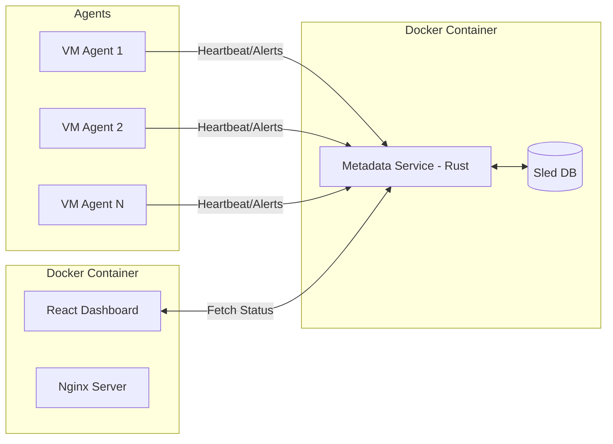

# Integrity Monitoring Dashboard Specification

## 1. Overview

The Integrity Monitoring Dashboard is a modern, responsive web application designed to visualize the real-time status of all agents running the Golden Image Integrity System. It provides a centralized view of fleet health, active alerts, and historical data.

## 2. Architecture

## 3. Tech Stack

- **Frontend Framework**: React 18+ (Create React App or Vite)
- **UI Library**: Material UI (MUI) or Tailwind CSS + ShadcnUI (for a modern, clean look)
- **State Management**: React Query (TanStack Query) for efficient API data fetching and caching.
- **Routing**: React Router
- **Charts**: Recharts or Chart.js for visualization (e.g., healthy vs. compromised nodes over time).
- **Containerization**: Docker (Multi-stage build).

## 4. UI/UX Design

### 4.1. Dashboard (Home)

- **Summary Cards**:
  - Total Agents Online
  - Healthy Agents (Green)
  - Agents with Warnings (Yellow)
  - Compromised Agents (Red)
- **Live Activity Feed**: A scrolling list of the latest alerts and heartbeats.
- **Cluster Health Graph**: A time-series chart showing the number of active violations over the last 24 hours.

### 4.2. Agent List View

- **Data Grid**: A sortable/filterable table of all known agents.
- **Columns**: Hostname, Image ID, IP Address, Last Seen, Status, Version.
- **Actions**: "View Details", "Quarantine" (if integrated with orchestrator).

### 4.3. Agent Detail View

- **Metadata**: VM details, OS version, Image ID.
- **Integrity Status**: Current state of file verification.
- **Violation History**: A list of all integrity violations reported by this specific agent.
- **Baseline Diff**: A visual representation of modified/added/deleted files compared to the golden image.

## 5. API Endpoints (Implemented)

The following endpoints support the dashboard and agent reporting pipeline:

| Method | Endpoint | Description |
|--------|----------|-------------|
| POST | `/agents/register` | Agent self-registration (returns `agent_id`) |
| POST | `/agents/heartbeat` | Receive heartbeat, update agent status |
| POST | `/agents/alert` | Receive alert, increment alert count, escalate status |
| GET | `/agents` | List all registered agents |
| GET | `/agents/{id}` | Get single agent details |
| GET | `/agents/{id}/heartbeats` | Last 50 heartbeats for agent |
| GET | `/agents/{id}/alerts` | Alerts for agent (most recent first) |
| GET | `/dashboard/summary` | Aggregate stats (agent counts, alert counts by period) |
| GET | `/baselines` | List all stored baselines |

All JSON responses use camelCase field naming to match the React frontend.

## 6. Implementation Status

### Phase 1: Backend Extension — Done

- `integrity-common` extended with `AgentInfo`, `Heartbeat`, `Alert`, `DashboardSummary`, and related types.
- `metadata-service` uses separate Sled trees (`agents`, `heartbeats`, `alerts`) for data isolation.
- All 9 new REST endpoints implemented.
- Alert escalation logic: Critical alerts set agent to Critical; Warning alerts promote Healthy to Warning.

### Phase 2: Frontend Development — Done

- React app with Material UI, React Query, and Recharts.
- Dashboard home with summary cards, status pie chart, and alert bar chart.
- Agent list with search/filter functionality.
- Agent detail view with heartbeat timeline chart and alert history.
- Baselines listing page with search.
- API client configured to use `/api` prefix (proxied by Nginx in production).

### Phase 3: Dockerization — Done

- Nginx serves React build and proxies `/api/*` requests to `metadata-service:8080`.
- `docker-compose.yml` orchestrates both services on a shared network.
- No CORS issues: all API calls go through the same origin via Nginx reverse proxy.
