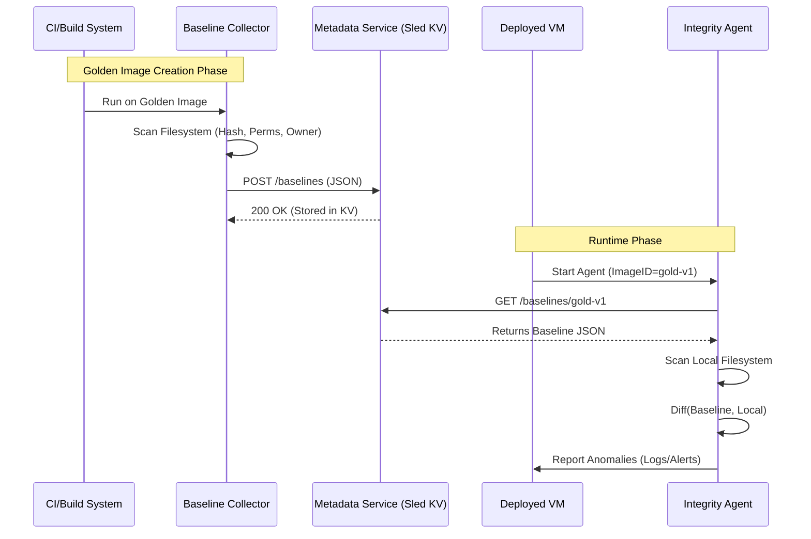

# Golden Image Integrity System - Design Document

## 1. System Overview

The system ensures that Virtual Machines (VMs) deployed from a "Golden Image" remain in their desired state. It consists of three main components:

1. **Baseline Collector**: Scans the Golden Image during the build process to create a "fingerprint" (baseline).
2. **Metadata Service**: A central server that stores these baselines.
3. **Integrity Agent**: Runs inside the deployed VM, fetching the baseline and verifying local files against it.

## 2. Architecture Diagram



## 3. Data Structures (Shared Library)

We will use a shared Rust library (`integrity-common`) to ensure consistency.

```rust
// Represents a single file's integrity data
pub struct FileIntegrityEntry {
    pub path: String,       // Relative to root, e.g., "/etc/passwd"
    pub sha256: String,     // Hex encoded hash
    pub mode: u32,          // Unix permissions (e.g., 0o644)
    pub uid: u32,           // User ID
    pub gid: u32,           // Group ID
}

// Represents the full baseline for an image
pub struct Baseline {
    pub image_id: String,   // Unique identifier (e.g., "ubuntu-2204-hardened-v1")
    pub timestamp: String,  // ISO8601 creation time
    pub entries: Vec<FileIntegrityEntry>,
}
```

## 4. API Specification (Metadata Service)

**Base URL**: `http://metadata-service:8080`

### Store Baseline

- **Endpoint**: `POST /baselines`
- **Body**: JSON serialization of `Baseline` struct.
- **Response**: `201 Created` or `400 Bad Request`.

### Retrieve Baseline

- **Endpoint**: `GET /baselines/{image_id}`
- **Response**: JSON serialization of `Baseline` struct.
- **Errors**: `404 Not Found`.

## 5. Component Logic

### Baseline Collector

- **Input**: Path to scan (default `/`), Output Server URL, Image ID.
- **Exclusions**: Must skip volatile directories: `/proc`, `/sys`, `/dev`, `/run`, `/tmp`, `/var/tmp`, `/var/log`.
- **Output**: Sends JSON to Metadata Service.

### Metadata Service

- **Tech**: Rust, Actix-web (or Axum), Sled (Embedded KV Store).
- **Storage Strategy**:
  - **Key**: `image_id` (String)
  - **Value**: `Baseline` struct serialized as JSON (or Bincode for more speed, but JSON for debuggability).
  - Sled is chosen for its high performance and simplicity in Rust.

### Integrity Agent

- **Input**: Metadata Service URL, Image ID (via ENV var), Check Interval.
- **Logic**:
    1. Fetch Baseline for `Image ID`.
    2. Walk local filesystem (same exclusions as Collector).
    3. Compare current state vs Baseline.
    4. **Anomalies**:
        - **Modified**: Hash mismatch.
        - **Metadata Changed**: Mode/UID/GID mismatch.
        - **Added**: File exists locally but not in baseline.
        - **Deleted**: File in baseline but missing locally.
    5. Log anomalies to Stdout/Syslog.
