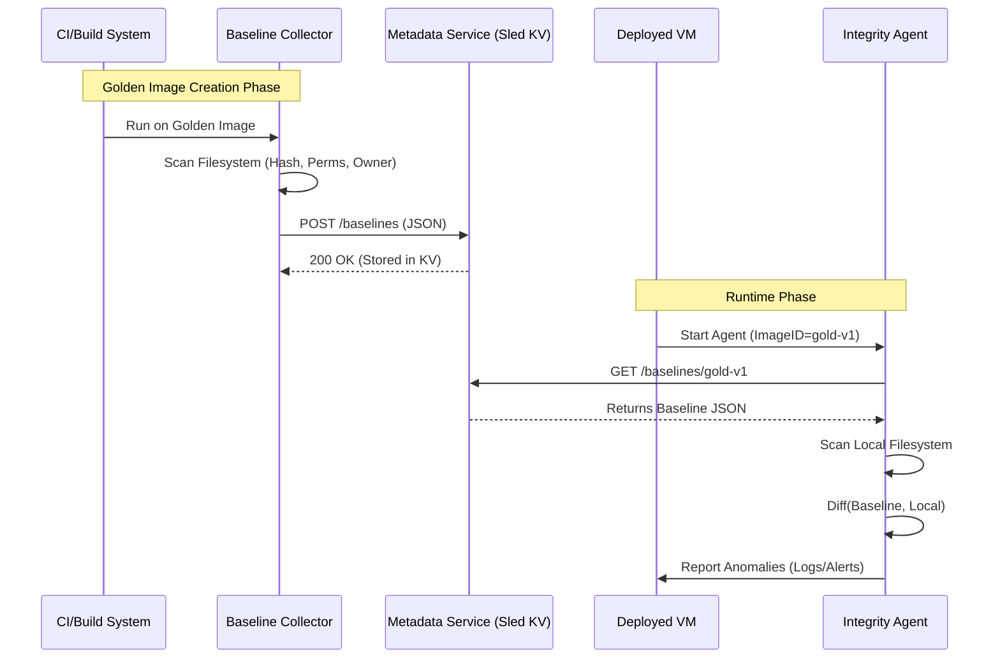

# Golden Image Integrity System - Design Document

## 1. System Overview

The system ensures that Virtual Machines (VMs) deployed from a "Golden Image" remain in their desired state. It consists of three main components:

1. **Baseline Collector**: Scans the Golden Image during the build process to create a "fingerprint" (baseline).
2. **Metadata Service**: A central server that stores these baselines.
3. **Integrity Agent**: Runs inside the deployed VM, fetching the baseline and verifying local files against it.

## 2. Architecture Diagram


```mermaid
sequenceDiagram
    participant BuildSystem as CI/Build System
    participant Collector as Baseline Collector
    participant Server as Metadata Service (Sled KV)
    participant VM as Deployed VM
    participant Agent as Integrity Agent

    Note over BuildSystem, Collector: Golden Image Creation Phase
    BuildSystem->>Collector: Run on Golden Image
    Collector->>Collector: Scan Filesystem (Hash, Perms, Owner)
    Collector->>Server: POST /baselines (JSON)
    Server-->>Collector: 200 OK (Stored in KV)

    Note over VM, Agent: Runtime Phase
    VM->>Agent: Start Agent (ImageID=gold-v1)
    Agent->>Server: GET /baselines/gold-v1
    Server-->>Agent: Returns Baseline JSON
    Agent->>Agent: Scan Local Filesystem
    Agent->>Agent: Diff(Baseline, Local)
    Agent->>VM: Report Anomalies (Logs/Alerts)
```

## 3. Data Structures (Shared Library)

We will use a shared Rust library (`integrity-common`) to ensure consistency.

```rust
// Represents a single file's integrity data
pub struct FileIntegrityEntry {
    pub path: String,       // Relative to root, e.g., "/etc/passwd"
    pub sha512: String,     // Hex encoded SHA-512 hash
    pub mode: u32,          // Unix permissions (e.g., 0o644)
    pub uid: u32,           // User ID
    pub gid: u32,           // Group ID
}

// Represents the full baseline for an image
pub struct Baseline {
    pub image_id: String,   // Unique identifier (e.g., "ubuntu-2204-hardened-v1")
    pub timestamp: String,  // ISO8601 creation time
    pub entries: Vec<FileIntegrityEntry>,
}

// Agent health status
pub enum AgentHealth { Healthy, Warning, Critical }

// Agent information for dashboard display
pub struct AgentInfo {
    pub id: String,
    pub hostname: String,
    pub ip_address: String,
    pub status: AgentHealth,
    pub last_heartbeat: Option<DateTime<Utc>>,
    pub alert_count: u64,
    pub image_id: String,
}

// Heartbeat sent periodically by agents
pub struct Heartbeat {
    pub agent_id: String,
    pub timestamp: DateTime<Utc>,
    pub status: AgentHealth,
    pub image_id: String,
}

// Alert severity and alert data
pub enum AlertSeverity { Info, Warning, Critical }

pub struct Alert {
    pub id: String,
    pub agent_id: String,
    pub message: String,
    pub timestamp: DateTime<Utc>,
    pub severity: AlertSeverity,
}

// Dashboard summary
pub struct DashboardSummary {
    pub total_agents: u64,
    pub healthy_agents: u64,
    pub warning_agents: u64,
    pub critical_agents: u64,
    pub alerts_today: u64,
    pub alerts_this_week: u64,
    pub alerts_this_month: u64,
}
```

All structs use `#[serde(rename_all = "camelCase")]` for JSON serialization to match the React frontend expectations.

## 4. API Specification (Metadata Service)

**Base URL**: `http://metadata-service:8080`

### Baselines

| Method | Endpoint | Description |
|--------|----------|-------------|
| POST | `/baselines` | Store new baseline. Body: `Baseline` JSON. Response: `201 Created`. |
| GET | `/baselines` | List all baselines (returns image_id, timestamp, file count). |
| GET | `/baselines/{image_id}` | Retrieve full baseline. `404` if not found. |

### Agents

| Method | Endpoint | Description |
|--------|----------|-------------|
| POST | `/agents/register` | Register agent. Body: `RegisterAgent`. Response: `201` with `agent_id`. |
| POST | `/agents/heartbeat` | Receive heartbeat. Body: `Heartbeat`. Updates agent status. |
| POST | `/agents/alert` | Receive alert. Body: `PostAlert`. Creates alert, updates agent status. |
| GET | `/agents` | List all registered agents. |
| GET | `/agents/{id}` | Get single agent details. `404` if not found. |
| GET | `/agents/{id}/heartbeats` | Get last 50 heartbeats for agent. |
| GET | `/agents/{id}/alerts` | Get alerts for agent (most recent first). |

### Dashboard

| Method | Endpoint | Description |
|--------|----------|-------------|
| GET | `/dashboard/summary` | Aggregated stats: agent counts by status, alert counts by time range. |

### Storage Strategy

The Metadata Service uses Sled with separate trees for data isolation:
- **Default tree**: Baselines (keyed by `image_id`)
- **`agents` tree**: Agent info (keyed by `agent_id`)
- **`heartbeats` tree**: Heartbeat records (keyed by `{agent_id}:{timestamp_millis}`)
- **`alerts` tree**: Alert records (keyed by `alert_id`)

## 5. Component Logic

### Baseline Collector

- **Input**: Path to scan (default `/`), Output Server URL, Image ID.
- **Exclusions**: Must skip volatile directories: `/proc`, `/sys`, `/dev`, `/run`, `/tmp`, `/var/tmp`, `/var/log`.
- **Output**: Sends JSON to Metadata Service.

### Metadata Service

- **Tech**: Rust, Actix-web (or Axum), Sled (Embedded KV Store).
- **Storage Strategy**:
  - **Key**: `image_id` (String)
  - **Value**: `Baseline` struct serialized as JSON (or Bincode for more speed, but JSON for debuggability).
  - Sled is chosen for its high performance and simplicity in Rust.

### Integrity Agent

- **Input**: Metadata Service URL, Image ID, Hostname, IP Address (via CLI args).
- **Logic**:
    1. Register with Metadata Service (`POST /agents/register`), receive `agent_id`.
    2. Fetch Baseline for `Image ID`.
    3. Walk local filesystem (same exclusions as Collector).
    4. Compare current state vs Baseline.
    5. **Anomalies**:
        - **Modified**: Hash mismatch.
        - **Metadata Changed**: Mode/UID/GID mismatch.
        - **Added**: File exists locally but not in baseline.
        - **Deleted**: File in baseline but missing locally.
    6. Report each anomaly as an alert (`POST /agents/alert`).
    7. Send heartbeat with final status (`POST /agents/heartbeat`).
    8. In monitor mode: background task sends heartbeats every 30 seconds.
    9. Graceful degradation: if metadata service is unreachable, agent continues with local-only ID.
